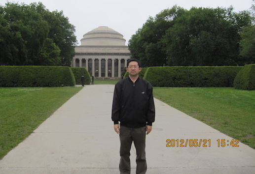

---
# You don't need to edit this file, it's empty on purpose.
# Edit theme's home layout instead if you wanna make some changes
# See: https://jekyllrb.com/docs/themes/#overriding-theme-defaults
layout: default
---

<!--  -->

我的研究领域主要包括近似算法，组合优化决策，机器学习算法。我在美国密苏里大学哥伦比亚校区获得计算机科学博士学位，现任教于海南大学计算机科学系。
如果你想在相关领域寻找感兴趣的课题，欢迎与我联系，我的邮箱是 qqi@hainanu.edu.cn。

<!--请访问新的网页地址，[https://qiqi789.netlify.app](https://qiqi789.netlify.app)-->




